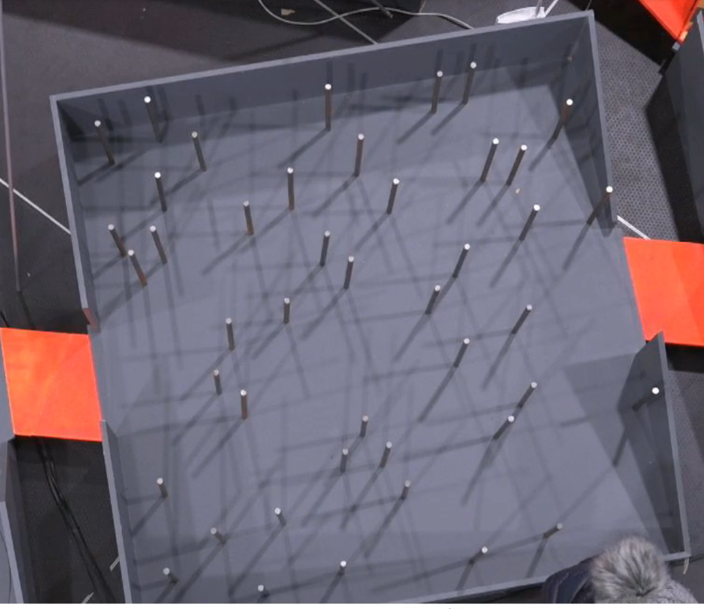
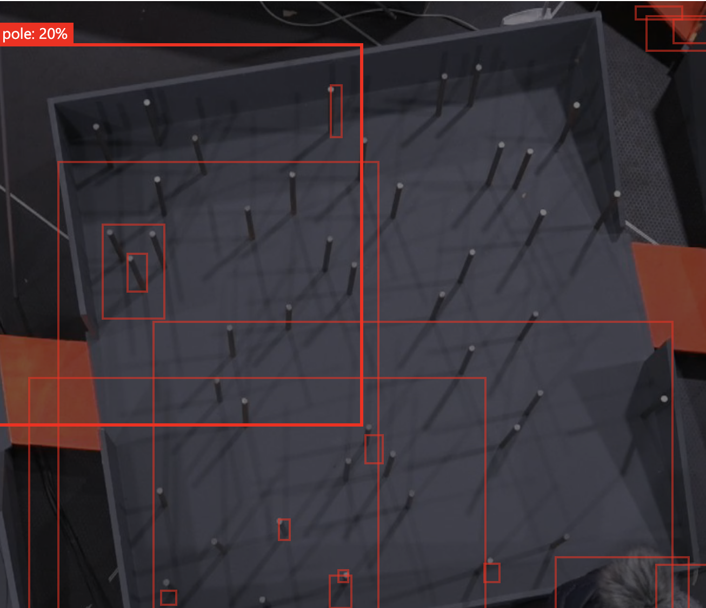
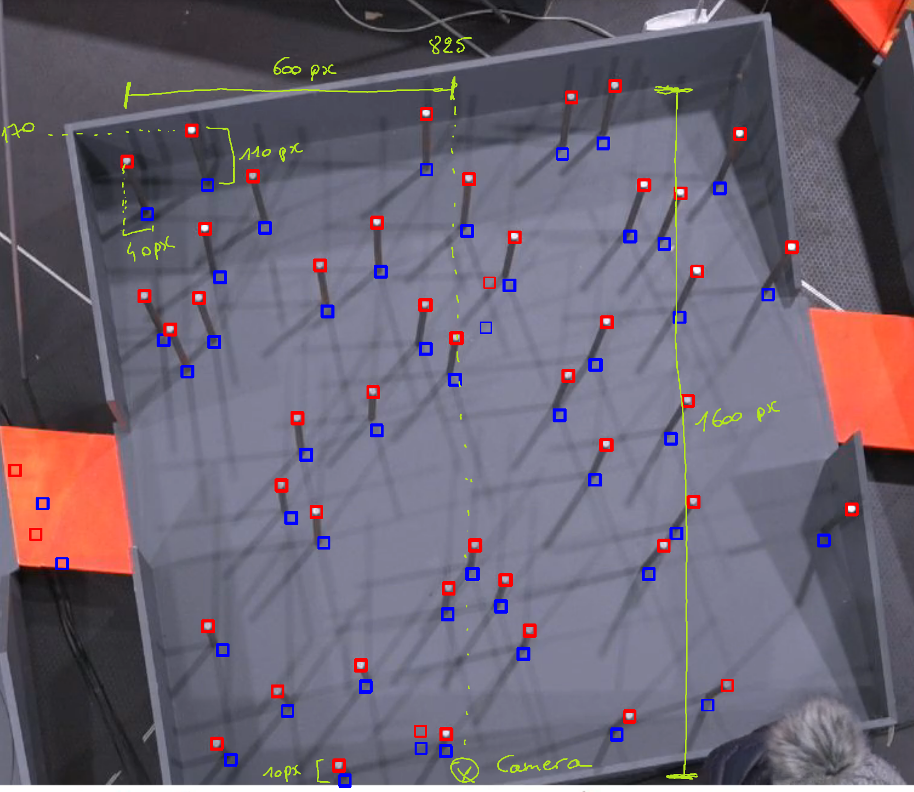

# Robot Uprising - Using computer vision to find a path through an obstacle course

This weekend we participated in the Robot Uprising hackathon, where teams compete through different challenges to pass a giant maze with the robots they've built. [Read more about Robot Uprising here](https://robotuprising.fi/hackathon/robot-uprising/)

## TL;DR

> - We tried using the web portal on Custom Vision to create an object recognition model that would identify the obstacles but it failed detecting them due to pole size, color and lighting around the track. Custom Vision is more suitable for identifying major differences.
> - As the track is quite static, we used a single frame from the feed to train the model and find the optimal path through the maze.
> - Used OpenCV for pattern matching to identify the top of the poles but as there is only one camera above the area, we had to map out the root of each pole, taking into account the pespective of the camera angle.
> - We built a grid where we mapped the whole field and mapped the obstacles from the image to the right grid cells.
> - Used the A* search algorithm to find the optimal path through the grid.

You can get the full solution through the Jupyter notebook in this repo.



## Hackathon Challenge

One part of the giant maze is the *THE ROOT*, which the robots need to navigate through, avoiding obstacles and finding the exit.

The attendees are provided a birdseye view camera, that is looking at the *THE ROOT* from above. Using this camera, the attendees could find their optimal path.

The attendees can solve the challenge with various sensors on the robot, to navigate through the field, using Computer Vision is optional, but it grants additional 5 points for the competition.

### Technical challenges

- The *THE ROOT* is placed in the middle of the hackathon field, with multiple lights around the obstacles, creating several shadows across the field.
- Both the obstacles and the field are gray, and have several shadow around them, making it sometimes hard to recognize the root of the pole.
- There is only one camera above the large *THE ROOT* area, meaning you'll need to take into account the perspective when looking at poles further from the center point.
- The camera is positioned in a way that it's not aligned to the shape and entrance/exit of the track. So you'll need to take into account the orientation of the video-feed vs. the track.
- Network connectivity can be unstable due to many devices and personal hotspots around.

**Extra:** The current obstacle course is fixed, meaning the location of the poles doesn't change. We'd like to see a solution in the future, that is also able to adapt to changes in the field.

## Possible solutions

There are several ways to approach this challenge. In this post we provide one possible solution.

### Ruling out the ready-made services (Cognitive Services and Custom Vision)

[Azure Custom Vision](http://customvision.ai) allows you to easily build and deploy your own image classifiers. In short, you upload a set of images to the service, label them appropriately and train your model. You can use it either for image classification ("Does this image contain a dog?") or for object detection ("Where in this image is the dog?")

> Azure Custom Vision is available through the web portal and the SDKs for .NET, Python, Java, Node.js and Go. And you can export the models for Tensorflow, CoreML, ONNX or in a Windows or Linux container.

As stated in the [documentation](https://docs.microsoft.com/en-us/azure/cognitive-services/custom-vision-service/home), it's suitable for identifying major differences between images — not subtle differences like dents in quality assurance etc.

#### Why Azure Custom Vision didn't work in this case




- The minimum number of labeled images for Azure Custom Vision is 15. And officially you should have at least 50 images per label, to start prototyping your model.
  - The location of the obstacles doesn't change in the *THE ROOT*, they're fixed elements. So we have only one, or multiple very similar photos to train the Custom Vision model on.
  - To get the minimum 15 images to label, we cropped the single image to 15 smaller images and labeled the pole locations accordingly.
- Why is this challenging for Custom Vision? The poles are too small, their color is very similar to the stage and the shadows create easily more false positivies.

If we had multiple robots or larger objects on the track and would like to identify them, we could explore that using Custom Vision, as they are "major differences".

### Using pattern matching and A* pathfinding



One solution for this is to use [OpenCV template matching to detect the poles](https://docs.opencv.org/master/d4/dc6/tutorial_py_template_matching.html) and then the Pathfinding library to find the correct path in the grid.

All the shadows and different elements on the field make it hard to detect the whole pole. We'll focus on detecting the white top, and then calculate the base of the pole from there.

```python
#Change image to gray to ignore color differences in pattern matching
img_gray = cv2.cvtColor(img_rgb, cv2.COLOR_RGB2GRAY)

#Load the pole tip template image, with 0 color depth - gray scale image 
template = cv2.imread('poletip3.png',0)
# Get width and the height of the template
w, h = template.shape[::-1]

# Use OpenCV to match the template in the original image
# This finds the occurrences of the template in the source image 
res = cv2.matchTemplate(img_gray,template,cv2.TM_CCOEFF_NORMED)
```

Calculate the base of the pole

```python
# Array to store coordinates of the base of the poles
base_coords = []

# Loop over all matches
for pt_top in zip(*top_coords[::-1]):

  # Calculate the correction function

  # 100 = height of the pole at the top most point of the image minus the height of the lowest pole in the image (pole_heigh_delta)
  # 1600 = distance in pixels between lowest and highest pole 
  # 1768 = Y coordinates of the camera (position where the base of the pole and the top of the pole are the same)
  vertical_corr = int(100/1600 * (1768-pt_top[1]+170))

  # 40 = horizontal offset between the x position of the tip and x position of the base of the pole (e.g. if you draw a straight line from the top to the bottom of the pole, the number is the difference betwen these two lines)
  # 600 = distance between x coordinates of the camera and horizontal top position of the left most pole 
  # 825 = X coordinates of the camera (position where the base of the pole and the top of the pole are the same)
  horizontal_corr = int(40/600 * (825-pt_top[0]))

  # Here we are assuming that the height of the poles are similar in length
  # Get the coordinates of the base of the pole
  pt_base = (pt_top[0] + horizontal_corr, pt_top[1]+vertical_corr)

  # Store the coordinate in an array
  base_coords.append(pt_base)

return base_coords
```

After we get the X,Y coordinates of the base of the poles we'll overlay a virtual grid on top of the image, and calcualte the position of the poles in that grid. We will then use the grid positions to block out the grid cells that the robot can't pass through and use that as an input for path finding.

``` python

# based on X and Y calculate a position in the grid where the blocking cell is
def get_blocking_cells(cell_size_x, cell_size_y, obstacle_coords):
    grid = []
    for coord in obstacle_coords:
        # translate x coord in cell-x
        cell_x =  math.floor(coord[0] / cell_size_x)
        # translate y coord in cell-y
        cell_y =  math.floor(coord[1] / cell_size_y)

        grid.append((cell_x, cell_y))
    return grid

# generate an overlay grid on top of the image
# we are placing a straight square grid, while slightly cropping the image
# the image could be rotated to compensate for the position of the camera
def generate_grids(blocking_cells, width, height, cell_size_x, cell_size_y):
    grids = []
    for x in range(0, math.floor(width / cell_size_x)+1):
        row = []
        for y in range(0, math.floor(height / cell_size_y)+1):
            row .append(1)
        grids.append(row)

    # set the blocking cell to 0 meaning that it can't be passed
    for (x,y) in blocking_cells:
        grids[x][y] = 0

    return grids

def find_path(matrix):
    g = Grid(matrix=matrix)
    start = g.node(1, 7)
    end = g.node(15, 7)
    finder = AStarFinder()
    path, runs = finder.find_path(start, end, g)
    print('operations:', runs, 'path length:', len(path))
    print(g.grid_str(path=path, start=start, end=end))

# the path is marked below with x, where s is the start of the path and e is the end of the path and # is position of the 
if __name__ == "__main__":
    corordinates =  find_base_coordinates()
    block_points = get_blocking_cells(100, 100, corordinates)
    grids = generate_grids(block_points, 1768, 1532, 100, 100)
    find_path(grids)
    #print(grids)
```

The next steps from here would be to map this path to actual movement of the robot. The robot could retrieve the path from the cloud and execute on the devices, or the pathfinding could be deployed on the actual device.

## Deploying on the (Edge) device

So, we managed to identify the path for the purpose of the hackathon. What if we wanted to leverage a similar solution in production? One of the things you'll need to consider is how would you manage several devices at the same time, monitor their health and ensure they're always running the latest version of your logic and computer vision models.

### Network connectivity

In many cases, we can't always count on having a reliable internet connection. With IoT Edge you can run your app logic and computer vision models locally without a network connection. And when the devices do get some network connectivity, you want to be able to remotely update and manage them, without touching the devices.

### Using Azure IoT Edge

You can package your computer vision models and your app logic into containers. Then place these containers as *modules* (= implemented as Docker containers) on the IoT Edge Device, which will manage the communication between the different modules and the cloud.

> You might for example have a module that fetches frames from the video camera feed, and another module that uses your computer vision classifier to identify objects from that frame.

#### How do you go on about this

There's a good quickstart for [Deploying code on Linux](https://docs.microsoft.com/en-us/azure/iot-edge/quickstart-linux) or [Windows](https://docs.microsoft.com/en-us/azure/iot-edge/quickstart) devices, if you want to quickly get an overview of how it works.

- On Azure, register an IoT Hub, that manages communication between the cloud and your IoT devices, including the Edge devices.
- Install and run Azure IoT Edge on your device
- Develop your Edge module and include your business logic.
- Register these module containers and serve them from the Docker Hub or creating your own private [Azure Container Registry](https://docs.microsoft.com/en-us/azure/container-registry/container-registry-intro), from where the containers can be served to your Edge devices.
- Deploy the Edge modules to your IoT Edge devices through IoT Hub

You can then update and deploy modules through the IoT Hub on Azure Portal, CLI or Visual Studio Code. Read more about [Deploying Azure IoT Modules](https://docs.microsoft.com/en-us/azure/iot-edge/how-to-deploy-modules-portal)

Read more about [developing custom modules for IoT Edge](https://docs.microsoft.com/en-us/azure/iot-edge/how-to-vs-code-develop-module).

### What about Machine Learning services

In Azure we have 3 types of services:

1. [Cognitive Services](https://docs.microsoft.com/en-us/azure/cognitive-services/welcome) contain machine learning capabilities and give you a REST API to solve general problems such as analyzing text for emotional sentiment or analyzing images to recognize objects or faces. You don't need special machine learning or data science knowledge to use these services.
2. [Custom Vision](https://docs.microsoft.com/en-us/azure/cognitive-services/custom-vision-service/home) allows you to label your own images and easily build, deploy, and improve your own image classifiers. You can build either image classifiers or object detection.
3. [Azure Machine Learning Service](https://docs.microsoft.com/en-us/azure/machine-learning/service/overview-what-is-azure-ml) contains a set of services that help you train, deploy, automate, and manage machine learning models. You can either use the visual interface, Jupyter notebooks or the Azure Machine Learning SDKs.

In addition Azure providers services like Azure Notebooks, Azure Databricks and more.

### BONUS: Visual Object Tagging Tool (VoTT) for labeling large sets of data

VoTT helps you label images, import/export data from cloud or local storage providers and exporting your labels for Azure Custom Vision, Tensorflow, JSON, CSV.
